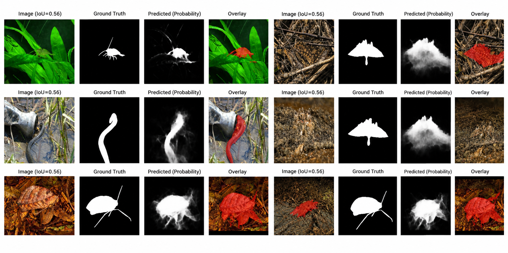

# Camouflaged Object Segmentation

A deep learning for detecting and segmenting objects that visually blend into their surroundings. Given a natural RGB image, the model identifies the camouflaged object and generates a pixel-level segmentation mask separating it from the background. The project implements and compares two segmentation architectures, U-Net with a ResNet18 encoder and SegFormer with a MiT-B1 encoder, trained on paired images and ground-truth masks. The pipeline includes image preprocessing, weighted BCE + Dice loss, validation-based threshold selection, early stopping, and test-time augmentation. The final model is evaluated across multiple camouflage benchmarks using IoU, Dice, precision, recall, and MAE to measure how accurately the predicted masks recover the hidden objects.

## Applications

Binary camouflage segmentation has applications across fields where objects blend into their surroundings, including ecological monitoring, search and rescue, medical imaging, industrial inspection, defense and surveillance research, and agricultural pest detection. These applications involve detecting targets that are difficult to distinguish from complex backgrounds due to similar color, texture, or patterns.

## Dataset

Kaggle "Camouflaged-Object-Detection" (COD10K + CAMO training pool, evaluated on the CAMO,
CHAMELEON, COD10K, and NC4K benchmarks). 11,000 matched image/mask training pairs (9,900
train / 1,100 validation), 6,473 test pairs across the four benchmarks (CAMO 250, CHAMELEON 76,
COD10K 2,026, NC4K 4,121). Camouflaged objects cover a mean of 5.7% of image area, motivating
the loss weighting described below.

## Method

Two architectures were trained and compared under identical conditions, with the winner selected
by validation performance rather than assumed in advance:

- **Baseline** - U-Net, ResNet18 encoder (ImageNet-pretrained).
- **Main model** - SegFormer, MiT-B1 encoder (ImageNet-pretrained).

Both were trained at 288×288 with AdamW, cosine LR scheduling, mixed precision, and early stopping
(patience 5 on validation Dice). The segmentation problem is formulated as learning a function
over raw, unbounded logits,

$$
f_\theta : \mathbb{R}^{H\times W\times3}
\rightarrow \mathbb{R}^{H\times W},
$$

where an input image $I$ produces a pixel-wise foreground probability map via a sigmoid,

$$
P = \sigma(f_\theta(I)).
$$

The binary prediction is obtained using a validation-tuned threshold $\tau$:

$$
\hat{M}_{ij} =
\begin{cases}
1, & P_{ij}\geq\tau,\\
0, & P_{ij}<\tau.
\end{cases}
$$

Training minimizes a BCE + Dice objective:

$$
\mathcal{L} = \mathcal{L}_{BCE} + \mathcal{L}_{Dice}.
$$

Because the mean foreground coverage is only 5.7% (measured precisely at $p\approx0.0575$), BCE
uses a positive-class weight derived from the foreground/background ratio:

$$
w_+ = \frac{1-p}{p} = \frac{1-0.0575}{0.0575} \approx 16.4.
$$

The weighted BCE term is

$$
\mathcal{L}_{BCE} = -\frac{1}{HW}\sum_{i=1}^{H}\sum_{j=1}^{W}\left[w_+M_{ij}\log P_{ij} + (1-M_{ij})\log(1-P_{ij})\right].
$$

Dice loss directly optimizes foreground overlap:

$$
\mathcal{L}_{Dice} = 1-\frac{2\sum_{i,j}M_{ij}P_{ij}+\epsilon}{\sum_{i,j}M_{ij}+\sum_{i,j}P_{ij}+\epsilon}.
$$

Thus, the learned parameters can be expressed as

$$
\theta^* = \arg\min_\theta \mathbb{E}_{(I,M)\sim\mathcal{D}}\left[\mathcal{L}\left(\sigma(f_\theta(I)),M\right)\right].
$$

At inference, the two horizontally-flipped logit maps are averaged before the sigmoid is applied
(test-time augmentation):

$$
P_{TTA} = \sigma\left(\frac{1}{2}\left[f_\theta(I) + \text{flip}\left(f_\theta(\text{flip}(I))\right)\right]\right).
$$

The final threshold $\tau$ is selected independently on the validation set by maximizing Dice
rather than assuming $\tau=0.5$.

Dataset pairing is performed by filename stem rather than assumed folder-to-folder correspondence,
since Kaggle repackagings vary in structure and may contain masks without matching images.
## Results

Validation, both models at their own tuned threshold:

| Model | Threshold | IoU | Dice | Precision | Recall | MAE |
|---|---:|---:|---:|---:|---:|---:|
| U-Net (ResNet18) | 0.70 | 0.580 | 0.648 | 0.668 | 0.833 | 0.076 |
| SegFormer (MiT-B1) | 0.70 | 0.567 | 0.626 | 0.734 | 0.744 | 0.088 |

U-Net was selected for final evaluation. SegFormer's validation Dice peaked at epoch 7 and
triggered early stopping at epoch 12/18; U-Net trained the full 18 epochs and was still
improving at the end.

Test set, by benchmark (U-Net, TTA, threshold 0.70):

| Benchmark | n | IoU | Dice | Precision | Recall | MAE |
|---|---:|---:|---:|---:|---:|---:|
| CAMO | 250 | 0.469 | 0.584 | 0.680 | 0.682 | 0.161 |
| CHAMELEON | 76 | 0.602 | 0.726 | 0.640 | 0.888 | 0.109 |
| COD10K | 2,026 | 0.509 | 0.630 | 0.583 | 0.825 | 0.097 |
| NC4K | 4,121 | 0.522 | 0.638 | 0.699 | 0.735 | 0.121 |
| **Pooled** | 6,473 | **0.517** | **0.634** | 0.661 | 0.763 | 0.115 |

The principal overlap metrics are

$$
IoU=\frac{TP}{TP+FP+FN},
\qquad
Dice=\frac{2TP}{2TP+FP+FN},
$$

with

$$
Precision=\frac{TP}{TP+FP},
\qquad
Recall=\frac{TP}{TP+FN},
$$

and

$$
F_1=
2\frac{Precision\cdot Recall}
{Precision+Recall}.
$$

Note that for a binary mask, $F_1$ and Dice are the same quantity; both are listed here only
because both names are common in the respective literatures (detection vs. segmentation).

CAMO is consistently the hardest of the four benchmarks; CHAMELEON the easiest. Correlation
between object-coverage fraction and per-image IoU is weak ($r=0.30$), suggesting object size is
not the dominant factor in segmentation difficulty. The hardest failures at test time are
concentrated in a small set of natural camouflage specialists (cephalopods, leaf-mimicking
insects) rather than being spread evenly across the dataset.

## Known limitation

MAE (0.115) is higher here than in an earlier, unweighted-loss configuration (0.095), despite
higher IoU/Dice. The `pos_weight` correction trades calibration for detection sensitivity,
motivating a follow-up sweep over positive-class weights before treating the current setting as final.

---
